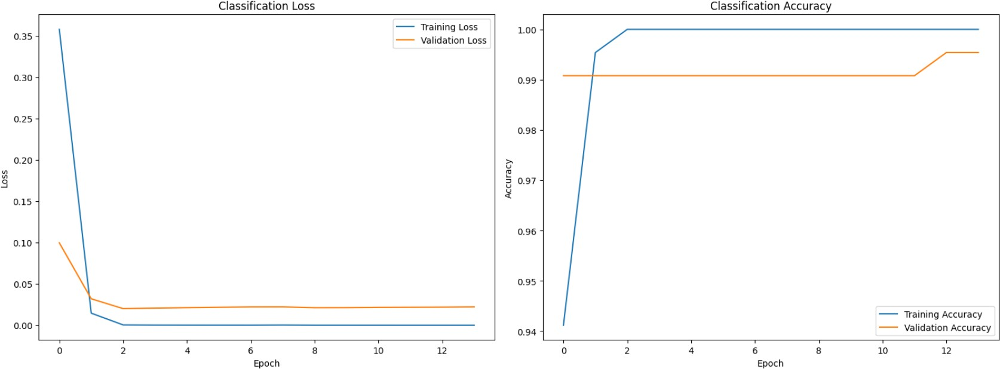

# Object Detection Using RCNN -Documentation

This project implements an object detection pipeline using the **Region-based Convolutional Neural Network (RCNN)** approach. The model leverages `MobileNetV2` as the base network for feature extraction and includes custom heads for classification and bounding box regression.

---

## Table of Contents

1. [Dependencies](#dependencies)
2. [Global Settings](#global-settings)
3. [Intersection over Union (IoU) Calculation](#intersection-over-union-iou-calculation)
4. [Image Resizing with Padding](#image-resizing-with-padding)
5. [Bounding Box Scaling](#bounding-box-scaling)
6. [Processing Images and Generating Region Proposals](#processing-images-and-generating-region-proposals)
7. [Model Architecture](#model-architecture)
8. [Training the Model](#training-the-model)
9. [Plotting Training History](#plotting-training-history)
10. [Saving the Model](#saving-the-model)

---

## Dependencies

The following libraries are required to run the code:

- `os`
- `cv2` (OpenCV)
- `numpy`
- `matplotlib`
- `random`
- `pickle`
- `sklearn`
- `tensorflow`

Install the necessary Python packages using pip:

```bash
pip install numpy matplotlib scikit-learn tensorflow opencv-python imutils
```

## Global Settings

The global settings define key parameters for the RCNN pipeline:

- `TARGET_IMAGE_SIZE`: Input size for MobileNetV2 (224, 224)
- `IOU_THRESHOLD_POSITIVE`: IoU threshold for positive samples (0.7)
- `IOU_THRESHOLD_NEGATIVE`: IoU threshold for negative samples (0.3)
- `IMAGE_DIRECTORY`: Directory containing the dataset
- `ANNOTATION_FILE`: Path to annotation files
- `CLASSES`: List of classes (butterfly, dalmatian, dolphin)
- `MAX_IMAGES_PER_CLASS`: Number of images processed per class (20)
- `MAX_PROPOSALS`: Maximum number of region proposals generated per image (20)
- `BATCH_SIZE`: Batch size for training (32)
- `NUM_EPOCHS`: Number of training epochs (20)
- `INIT_LR`: Initial learning rate (3e-5)

## Intersection over Union (IoU) Calculation

**Function**: `get_iou(bb1, bb2)`  
**Purpose**: Calculates the Intersection over Union (IoU) between two bounding boxes.  

### Inputs
- `bb1`, `bb2`: Dictionaries containing bounding box coordinates (`x1`, `y1`, `x2`, `y2`).

### Output
- `IoU value` (*float*).

## Image Resizing with Padding

**Function**: `resize_image_with_padding(image, target_size)`

**Purpose**:  
Resizes an image while preserving its aspect ratio by adding padding.

### Steps:
1. **Calculate the scaling factor**  
   Determine the factor by which the image should be resized based on the target size.
2. **Resize the image**  
   Apply the scaling factor to resize the image.
3. **Add padding**  
   Compute and add padding to the resized image so that its dimensions match the target size.

### Output:
- Resized and padded image
- Scaling factor
- Padding values

## Bounding Box Scaling

**Function**: `scale_bounding_box(bbox, scale, padding)`

*Purpose*:  
Scales bounding box coordinates after resizing and padding.

### Inputs:
- **bbox**: Original bounding box coordinates (`x1, y1, x2, y2`).
- **scale**: Scaling factor applied during resizing.
- **padding**: Padding values added during resizing (e.g., a tuple `(pad_x, pad_y)`).

### Output:
- **Scaled bounding box coordinates**: Adjusted coordinates (`x1, y1, x2, y2`) after applying the scale and padding.

## Processing Images and Generating Region Proposals

**Function**: `process_first_10_images(...)`

*Purpose*:  
Processes the first 10 images from each class, generates region proposals using Selective Search, and assigns labels based on IoU thresholds.

### Steps:
1. **Load Images and Annotations**  
   - Read the first 10 images per class from the dataset.  
   - Load corresponding annotation data for each image

2. **Resize Images with Padding and Scale Bounding Box Coordinates**  
   - Use a function like `resize_image_with_padding` to resize each image while preserving the aspect ratio by adding padding.  
   - Adjust the ground truth bounding box coordinates using a function such as `scale_bounding_box` based on the computed scaling factor and padding.

3. **Generate Region Proposals**  
   - Apply the Selective Search algorithm to each image to generate candidate region proposals.

4. **Assign Labels Based on IoU Thresholds**  
   - For each region proposal, compute the Intersection over Union (IoU) with the ground truth bounding boxes using a function like `get_iou`.  
   - Based on the IoU values:
     - If IoU is above the positive threshold (e.g., 0.7), assign the corresponding object class label.
     - If IoU is below the negative threshold (e.g., 0.3), assign the label as background.
     - Optionally, ignore proposals that fall between these thresholds.

### Output:
- *Processed Images*: Resized and padded images.
- *Labels*: Assigned labels for each region proposal (object class or background).
- *Bounding Boxes*: Adjusted coordinates for the proposals.

## Model Architecture

### Base Model: `MobileNetV2`
- *Pre-trained Model*: `MobileNetV2` is used as the base network.
- *Configuration*:
  - Top layers are removed (`include_top=False`).
  - The base model is frozen (`baseModel.trainable = False`) so that its weights are not updated during training.

### Custom Heads

1. Classification Head
   
- *Fully Connected Layers*: one or more layers with `ReLU` activation.
- *Output Layer*: Uses `softmax` activation with four neurons for multi-class (three classes + background) classification.

### Bounding Box Regression Head

- *Fully Connected Layers*: One or more layers with `ReLU` activation.
- *Output Layer*: Uses `sigmoid` activation with four neurons to predict normalized bounding box coordinates.

## Training the Model

### Compilation
- *Optimizer*: Adam optimizer with an initial learning rate of 3e-5.
- *Loss Functions*:
  - `categorical_crossentropy` for classification.
  - `mean_squared_error` for bounding box regression.
- *Metrics*:
  - **Classification**: Accuracy.
  - **Bounding Box Regression**: Mean Absolute Error (MAE).
- *Loss Weights*:  
  - Classification: 1.0  
  - Bounding Box Regression: 10.0 (to get more viable coodinates for bounding box)

### Training
- The model is trained for *20 epochs* with a *batch size of 32*.
- *Validation data* is used to monitor performance on unseen data.
- *Early stopping* is implemented to prevent overfitting.

### Plotting Training History

*Function*: `plot_training_history(history)`

*Purpose*: 

Plots training and validation loss/accuracy for both classification and bounding box regression.

*Outputs*:

- Classification loss and accuracy.
- Bounding box regression loss and MAE.

  A sample loss and accuracy plot is here:

  

## Saving the Model
- The trained model is saved as `object_detection_model.h5`.
- The label binarizer (`lb`) is saved as a pickle file (`lb.pickle`).

## Notes
- *Data Augmentation*: Consider adding data augmentation techniques (e.g., rotation, flipping) to improve model robustness.
- *Hyperparameter Tuning*: Experiment with different learning rates, batch sizes, and loss weights to optimize performance.
- *Evaluation Metrics*: Implement additional evaluation metrics like mAP for a more comprehensive assessment of the model's performance.

## Conclusion
This RCNN-based object detection model uses the ligh weight `MobileNetV2` pretrained model  for efficient feature extraction and adds custom heads for classification and bounding box regression. The model is suitable for small-scale object detection tasks and can be further improved with additional tuning and evaluation.
>**Link to the code:**[RCNN Multi-object detection](https://github.com/sijuswamyresearch/24DS736-DLVR-Assessments/blob/main/RCNN-for-multi-class-object-detection.py)
